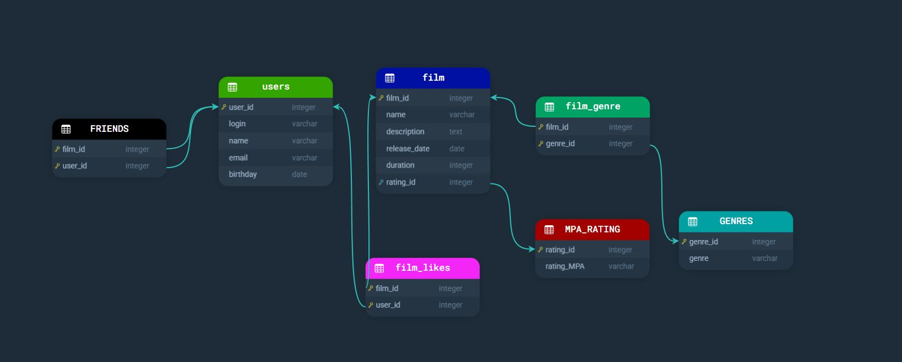

# java-filmorate


## Схема базы данных
В данной схеме представлено, как организованы таблицы для хранения информации о фильмах и пользователях. Схема включает в себя таблицы `films`, `genre`, `rating`, `user`.

### Примеры SQL-запросов
**Получение всех фильмов и данных о них**
```sql
SELECT * 
FROM film;
```
**Получение всех пользователей и их данных**
```sql
SELECT *
FROM user;
```
**Получение фильма по жанру**
```sql
SELECT f.rating
FROM films f
JOIN rating r ON f.film_id = r.rating_id 
WHERE g.rating = 'R';
```
**Получение фильма по жанру:**
```sql
SELECT f.genre 
FROM films f
JOIN genres g ON f.film_id = g.genre_id 
WHERE g.genre = 'Комедия';
```